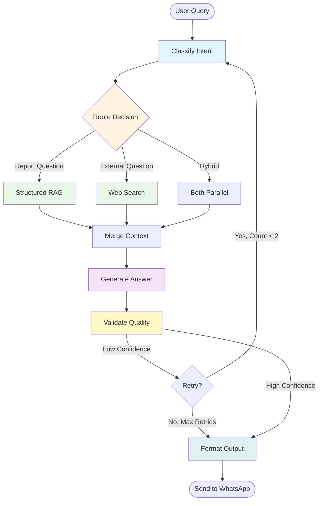

# Agent Architecture — LangGraph Orchestration

This document explains the agentic workflow design and why LangGraph is used.

## The Problem: Linear Pipelines Don't Scale

The original `rag_worker/app.py` is a simple linear pipeline:

```python
intent = classify(query)
context = retrieve(intent, query)
answer = generate(context, query)
send(answer)
```

This works for straightforward queries. But real-world agents need:

- **Conditional routing** — different queries need different tools (structured RAG vs web search vs both)
- **Retry loops** — if the answer is low quality, try again with broader context
- **Parallel execution** — run multiple retrievers simultaneously and merge results
- **State persistence** — track what we've tried, conversation history, confidence scores
- **Observability** — log which path a query took through the system

When you build these manually, you end up with deeply nested if/elif chains, manual state dicts, and loop counters scattered everywhere. It works but it's hard to test, hard to extend, and impossible to visualize.

## The Solution: Explicit State Graphs

LangGraph lets you define the agent's decision-making process as a **directed graph** where:

- **Nodes** are functions that take state and return updates
- **Edges** are routing decisions (fixed or conditional)
- **State** is a typed dict that flows through the entire graph

The graph is explicit, testable, and visualizable. You can draw it, test each node independently, and add new branches without touching existing code.

## Our Agent Graph



## Node Descriptions

| Node | Purpose | Input | Output |
|---|---|---|---|
| `classify_intent` | Determines query type (rfx_status, weekly_summary, etc.) and target weeks | query, available_weeks | intent, target_weeks |
| `structured_rag` | Retrieves context from parsed report JSON | intent, target_weeks, query | structured_context |
| `web_search` | Retrieves external knowledge (Tavily/Brave API) | query | web_context |
| `merge_context` | Combines structured + web results | structured_context, web_context | (merged in state) |
| `generate_answer` | Builds prompt and calls LLM (Claude/Gemini) | query, intent, context | raw_answer |
| `validate_answer` | Checks answer quality; decides if retry needed | raw_answer, retry_count | confidence |
| `format_output` | Applies WhatsApp formatting | raw_answer | final_answer |

## Conditional Edges (Routing Logic)

### `route_retriever(state) → str`
Decides which retrieval tool to use based on intent:
- `"structured_rag"` — report-based questions (most queries)
- `"web_search"` — external knowledge questions
- `"hybrid"` — questions needing both sources (future)

### `should_retry(state) → str`
Decides whether to retry generation:
- `"retry"` — if confidence is low and retry_count < 2, loop back to classify
- `"done"` — proceed to output

This is the key loop that demonstrates LangGraph's cycle capability.

## Why LangGraph vs Alternatives

| Framework | Best For | Why Not Here |
|---|---|---|
| **LangGraph** | Complex stateful graphs, loops, fine-grained control | ✅ Perfect fit — we need explicit routing and retry loops |
| **CrewAI** | Multi-agent teams with roles (Researcher, Writer, etc.) | ❌ Overkill — we don't need agent personas, just tool routing |
| **AutoGen** | Multi-agent conversations | ❌ No conversation needed — single agent, multiple tools |
| **Plain Python** | Simple linear pipelines | ❌ We need loops and conditional routing |

## Can You Build This Without LangGraph?

Yes. The `run_graph()` function includes a manual fallback that implements the exact same logic without LangGraph. It's ~30 lines of if/elif and a for-loop.

**The tradeoff:**
- Manual: 30 lines, no dependencies, full control, hard to visualize
- LangGraph: 100 lines, one dependency, explicit graph, easy to extend

For a portfolio project, LangGraph is worth it because:
1. It shows you understand modern agentic patterns
2. The graph is self-documenting (you can draw it)
3. It's the industry standard for complex agent workflows

## State Schema

```python
class AgentState(TypedDict):
    # Input
    query: str
    sender: str

    # Intent classification
    intent: str
    target_weeks: List[str]
    available_weeks: List[str]

    # Retrieval
    structured_context: Dict[str, Any]
    web_context: str
    retrieval_source: str  # "structured" | "web" | "hybrid"

    # Generation
    prompt: str
    raw_answer: str
    final_answer: str

    # Control flow
    retry_count: int
    confidence: str  # "high" | "low"
    error: Optional[str]
```

Every node receives this full state and returns a dict of fields to update. LangGraph merges the updates automatically.

## Interview Talking Points

**Q: Why use LangGraph instead of plain Python?**
A: LangGraph makes the agent's decision flow explicit and testable. Instead of buried if/elif chains, I have a graph I can draw and explain. Each node is independently testable. Adding a new retrieval source (e.g. web search) is just adding a node and an edge — no risk of breaking existing logic.

**Q: What's the performance overhead?**
A: Minimal. LangGraph is a thin orchestration layer — the actual work (retrieval, LLM calls) is unchanged. The graph compilation happens once at startup. Per-query overhead is <1ms.

**Q: Could you use CrewAI instead?**
A: CrewAI is designed for multi-agent teams where agents have roles and collaborate. My use case is simpler — one agent, multiple tools, conditional routing. LangGraph gives me the control I need without the abstraction overhead of agent personas.

**Q: Show me the retry loop.**
A: [Point to the `validate_answer → should_retry → classify_intent` cycle in the diagram]. If the generated answer is low confidence (too short, says "not available"), the graph loops back to classification with `retry_count` incremented. On retry, we could widen the week scope or try a different retrieval strategy. This is impossible to express cleanly in a linear pipeline.

**Q: What if LangGraph isn't installed?**
A: The `run_graph()` function has a manual fallback that implements the same logic without LangGraph. This proves I understand what LangGraph does under the hood — it's not magic, it's structured state management. The fallback also means the production Lambda doesn't need langgraph in its deployment package if we want to keep it lightweight.

---

Want me to now add the actual LangGraph implementation (with langgraph installed) so you can run both versions side-by-side and show the difference in an interview?